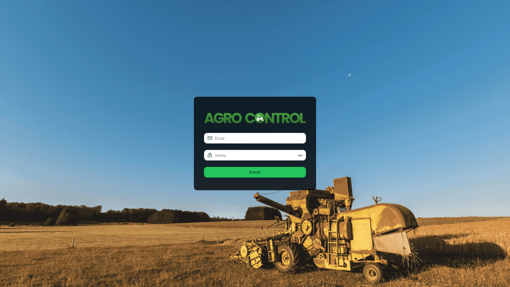

# Frontend Agro Control.

<p align="center">
  <a href="https://github.com/maiconlara/nextjs-template"></a>
</p>

💻 A seguir apresentamos a maneira correta de instalar e executar a aplicação Frontend do TCC Agro Control.


### Requisitos

- Node.js e um Gerenciador de Pacotes Node, a aplicação usa o pnpm.

### Como executar a aplicação

Clonando o repositório


1. No GitHub.com, navegue até https://github.com/Agro-Control/frontend.
2. Nas opções acima dos arquivos do repositório selecione Code.
3. Copie o código SSH ou HTTPS.
4. Abra o terminal e execute git clone git@github.com:Agro-Control/frontend.git (ou HTTPS).


Então, execute localmente:

```
pnpm install
pnpm build
pnpm start
```

### Estrutura do código

```
.
├── public               # Public folder
│   └── assets           # Image used in readme
├── src
│   ├── app              # Application folder
│   ├── assets           # Assets used in application
│   ├── components       # Elements use in pages
│   ├── lib              # Library configuration
│   └── utils            # Aux and reusable functions
│       └── hooks        # React and usable hooks
├── tailwind.config.ts   # Tailwind CSS configuration
└── tsconfig.json        # TypeScript configuration
```


<p align="center">Desenvolvido com amor pela equipe do TCC Agro Control 🤍</p>
